# Loot Price


Breve descrição: Um comparador de preços de jogos para PC com agentes de IA pode ser bastante útil e ainda abrir espaço para aplicar diversos conceitos de sistemas multiagentes, scraping, automação, IA e até gamificação. Vamos estruturar isso melhor:

---

## 🧠 **Resumo da Ideia**

Criar uma aplicação web ou desktop onde o usuário pode buscar por um jogo e receber uma comparação de preços entre diversas plataformas confiáveis (como Steam, Epic Games, GOG, Nuuvem, GreenManGaming etc.). O diferencial está no uso de **agentes de IA autônomos** que realizam periodicamente buscas, tratam os dados e alimentam um banco de dados para consulta em tempo real.

---

## 🔍 **Possíveis Funcionalidades**

### MVP (Produto Viável Mínimo):

- Busca por nome de jogo
- Listagem de preços em diferentes lojas
- Links diretos para as lojas
- Histórico de preços básico

### Pós-MVP:

- Alertas personalizados de queda de preço
- Wishlist de jogos por usuário
- Notificações por e-mail/Telegram/Discord
- Integração com APIs de biblioteca de jogos (ex: Steam)
- Score de confiabilidade das lojas
- Análise de tendências de preço
- Recomendação inteligente de promoções

---

## 🧠 **Sobre os Agentes de IA**

Cada agente pode:

- Ser responsável por uma loja específica (modularidade)
- Rodar periodicamente (cron ou sistema reativo)
- Usar scraping ou APIs
- Validar a confiabilidade das informações
- Tratar promoções (ex: bundle, cupons, %)

---

## 🛠️ **Stack Tecnológica**

- **Frontend:** Next.js
- **Backend:** Node.js (Express)
- **Banco de Dados:** PostgreSQL
- **Agentes de IA:**
    - Python + Scraping (requests + BeautifulSoup / Playwright)
    - **Langchain** para processamento de linguagem natural
    - Scrapy/Playwright/Requests + BeautifulSoup para scraping + Langchain
- **Agendamento e Orquestração:** Celery + Redis, Cronjobs, ou Apache Airflow
- **Hospedagem:** Vercel (frontend), Railway/Render/Heroku ou VPS

---

## 🗺️ **Roadmap por Etapas**

### 🔹 Fase 1 – Planejamento 

- Definir as lojas que serão integradas (talvez lojas com +4.7⭐ no Trustpilot)
- Verificar se possuem API ou se será necessário scraping
- Mapear os atributos importantes: nome, preço, link, desconto, data
- Escolher stack inicial e arquitetura (mono repo, microserviços, etc.)

### 🔹 Fase 2 – Protótipo e Backend 

- Criar estrutura de banco de dados
- Criar um scraper simples para 1 loja (ex: Steam)
- Desenvolver backend básico com endpoints REST ou GraphQL
- Criar um agente para realizar scraping e salvar no banco
- Documentar tudo em [API](https://codebugging3000.github.io/lootprice/api)

### 🔹 Fase 3 – Frontend 

- Tela de busca
- Tela de resultados com comparação
- Tela de detalhes do jogo
- Sistema simples de favoritos/localstorage

### 🔹 Fase 4 – Multiagentes e Escalabilidade 

- Implementar múltiplos agentes (um por loja)
- Orquestração de tarefas (agendamentos, reações a eventos)
- Sistema de logs, retries e confiabilidade

### 🔹 Fase 5 – Funcionalidades avançadas

- Alertas de preço
- Histórico de variação
- Login e personalização
- Dashboard pessoal

---

## 🧪 **Possíveis Desafios Técnicos**

- Rate limits das lojas
- Mudanças no layout das páginas
- Performance dos scrapers
- Sincronização entre agentes
- Validação e consistência dos dados

---

## 🌐 Exemplos de Lojas para Início

- [Steam](https://store.steampowered.com/)
- [Epic Games](https://store.epicgames.com/)
- [Nuuvem](https://www.nuuvem.com/)
- [GOG](https://www.gog.com/)
- [GreenManGaming](https://www.greenmangaming.com/)

---




```mermaid
flowchart TD
  subgraph Frontend ["Frontend (React)"]
    A1[Interface de Busca]
    A2[Listagem de Preços]
    A3[Detalhes do Jogo]
  end

  subgraph Backend API ["Backend REST API (Node.js ou FastAPI)"]
    B1[/"Endpoints públicos"/]
    B2[/"Validação e autenticação (futuro)"/]
    B3[/"Consulta ao Banco de Dados"/]
  end

  subgraph Agents ["Agentes de Coleta (Python)"]
    C1[Agent - Steam]
    C2[Agent - Epic Games]
    C3[Agent - Nuuvem]
    C4[Agent - GOG]
  end

  subgraph DB ["Banco de Dados (PostgreSQL)"]
    D1[Tabela Jogos]
    D2[Tabela Preços]
    D3[Tabela Histórico]
  end

  subgraph Scheduler [Orquestração de Agentes]
    E1[Cronjob / Airflow / Celery]
  end

  %% Ligações
  A1 --> B1
  A2 --> B1
  A3 --> B1
  B1 --> B3
  B3 --> D1
  B3 --> D2
  B3 --> D3

  E1 --> C1
  E1 --> C2
  E1 --> C3
  E1 --> C4

  C1 --> D1
  C2 --> D1
  C3 --> D1
  C4 --> D1

  C1 --> D2
  C2 --> D2
  C3 --> D2
  C4 --> D2

```

Seguindo a arquitetura de **microserviços**, podemos dividir o projeto **LootPrice** em serviços independentes, cada um com sua responsabilidade, linguagem e stack mais adequada. Abaixo está a estrutura geral sugerida + bibliotecas para cada serviço.

---

## 🗂️ **Estrutura de Diretórios - Microserviços**

```
lootprice/
├── .gitignore
├── docker-compose.yml
├── README.md
├── docs/                            # Documentação MkDocs
│   ├── mkdocs.yml
│   └── docs/
│       ├── index.md
│       └── architecture.md
│
├── frontend/                        # Frontend com Next.js
│   ├── public/
│   ├── src/
│   │   ├── pages/
│   │   ├── components/
│   │   ├── services/
│   │   └── styles/
│   ├── next.config.js
│   ├── package.json
│   └── tsconfig.json
│
├── backend/
│   ├── api-gateway/                 # Orquestrador de requisições
│   │   ├── src/
│   │   │   └── index.ts
│   │   ├── package.json
│   │   └── tsconfig.json
│   │
│   ├── auth-service/                # Serviço de autenticação
│   │   ├── src/
│   │   │   ├── controllers/
│   │   │   ├── routes/
│   │   │   ├── models/
│   │   │   └── index.ts
│   │   ├── package.json
│   │   └── tsconfig.json
│   │
│   ├── user-service/                # Gerencia usuários e preferências
│   │   ├── src/
│   │   │   ├── controllers/
│   │   │   ├── routes/
│   │   │   └── index.ts
│   │   ├── package.json
│   │   └── tsconfig.json
│   │
│   ├── price-tracker/              # Lógica de rastreamento e comparação de preços
│   │   ├── src/
│   │   │   ├── controllers/
│   │   │   ├── services/
│   │   │   ├── models/
│   │   │   └── index.ts
│   │   ├── package.json
│   │   └── tsconfig.json
│   │
│   ├── notification-service/       # Envio de notificações
│   │   ├── src/
│   │   │   ├── mailer/
│   │   │   ├── scheduler/
│   │   │   └── index.ts
│   │   ├── package.json
│   │   └── tsconfig.json
│   │
│   ├── scraper/                    # Scraper com agentes em Python
│   │   ├── agents/
│   │   │   ├── steam_agent.py
│   │   │   ├── epic_agent.py
│   │   │   └── nuuvem_agent.py
│   │   ├── utils/
│   │   │   └── parser.py
│   │   ├── main.py
│   │   └── requirements.txt
│   │
│   └── database/                   # Banco de dados (PostgreSQL)
│       └── init.sql
│
│
└── Dockerfile                      # Dockerfile principal (build multi-stage)

```

---

## 🔧 **Stacks e Bibliotecas por Serviço**

### 🔹 1. **gateway-api/** (REST API para o frontend)

**Linguagem:** Node.js com Express

- `typescript` – superset do JavaScript
- `jest` – testes
- `express` – servidor web
- `cors` – habilitar CORS
- `axios` ou `node-fetch` – requisições externas
- `pg` – conexão com o banco (Postgres)
- `dotenv` – variáveis de ambiente
- `joi` ou `zod` – validação de dados
- `swagger-ui-express` – documentação de API
- `prisma` – ORM para PostgreSQL

---

### 🔹 2. **scraper-agents/** (um por loja)

**Linguagem:** Python

**Bibliotecas:**

- `requests` ou `httpx` – chamadas HTTP
- `beautifulsoup4` – parsing de HTML
- `playwright` – scraping avançado com JS dinâmico
- `lxml` – parser rápido
- `pydantic` – validação de dados
- `sqlalchemy` – banco de dados
- `tenacity` – retries automáticos
- `loguru` – logs simplificados
- `schedule` – execução programada simples

*→ Alternativa: usar Scrapy como framework completo de scraping.*

---

### 🔹 3. **scheduler/** (orquestrador dos agentes)

**Linguagem:** Python

**Bibliotecas (dependendo da escolha):**

**Para algo simples:**

- `schedule` – cron-like em Python
- `APScheduler` – agendador de tarefas

**Para algo escalável:**

- `celery` + `redis` – fila de tarefas distribuída
- `airflow` – se quiser um DAG visual e mais controle

---

### 🔹 4. **frontend/** (cliente web)

**Linguagem:** TypeScript (React)

**Frameworks e libs:**

- `next.js`
- `jest` – testes
- `axios` ou `fetch` – chamadas à API
- `tailwindcss` – estilização moderna
- `react-query` ou `swr` – cache e fetch inteligente
- `zustand` ou `redux` – estado global (opcional)
- `chart.js` ou `recharts` – histórico de preços
- `heroicons` ou `phosphor-icons` – ícones

---

### 🔹 5. **database/**

- `PostgreSQL` - banco de dados relacional
- `prisma` - ORM (Node)
- `docker` - para local

---

### 🔹 6. **notifications/** (alertas e comunicação)

**Linguagem:** Python

**Bibliotecas:**

- `smtplib` ou `email` – e-mail SMTP
- `requests` – Webhooks (Telegram, Discord)
- `python-telegram-bot` – integração direta
- `sendgrid` / `mailgun` – e-mails via API

---

## ☁️ **Infraestrutura**

- **Docker** para cada serviço (multi-container)
- **Docker Compose** para orquestração local
- **GitHub Actions** – CI/CD
- **Railway / Render / Vercel** para deploy rápido
- **Monitoramento:** Grafana + Prometheus (futuramente)

---

## ✅ Checklist para o Início

| Etapa | Status |
| --- | --- |
| Estrutura de diretórios criada | ✅ |
| Dockerfile + Compose básico | ✅ |
| API Gateway funcional | ⬜ |
| 1 Agente funcional (ex: Steam) | ⬜ |
| Scheduler inicial com Cron | ⬜ |
| Frontend inicial com busca | ⬜ |
| Banco de dados funcional | ⬜ |

---